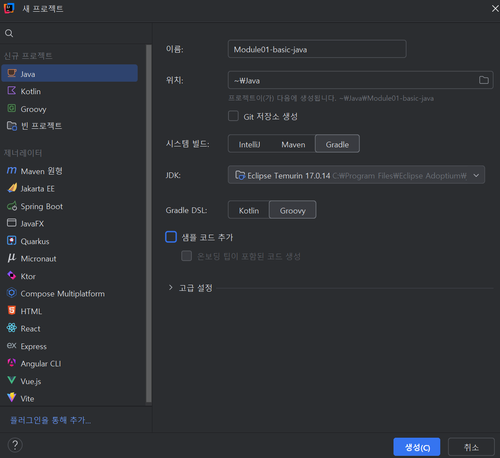
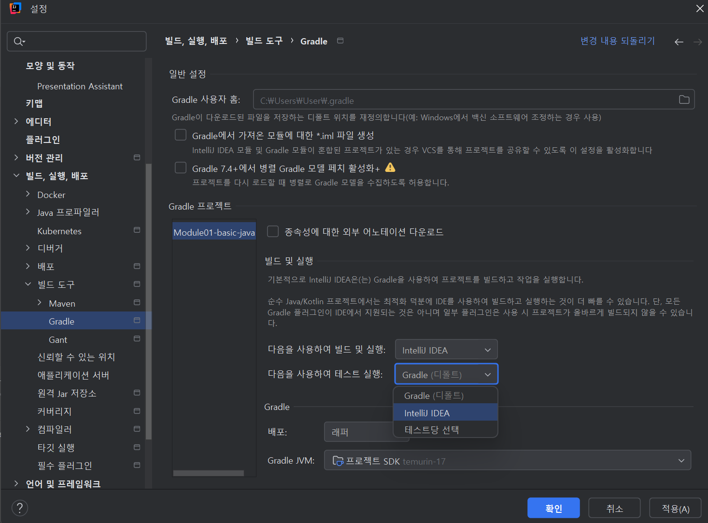
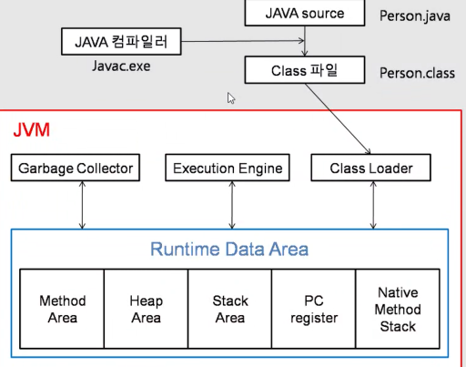
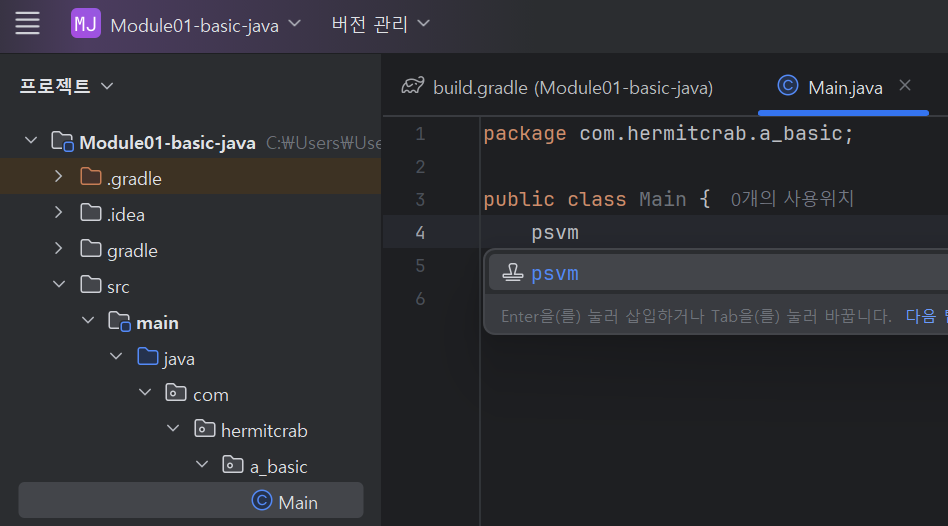
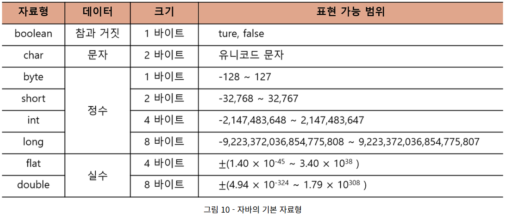

# [250312] Java Basic & Test

---

## IDE



## Java개요 및 실행 방식

### **Java란?**

- JVM을 사용하는 플랫폼 독립적인 언어(모든 OS에서 실행 가능)
- 하이브리드 방식 = 컴파일(한번에 모두 번역) + 인터프리터 방식(1줄씩 번역)
    - JIT(just - in - Time) 컴파일러 : 자주 실행되는 코드(핫스팟)를 네이티브 코드로 변환하여 성능 향상, JIT 덕분에 Java 프로그램은 처음 실행될 때는 느릴 수 있지만, 실행 시간이 길어질수록 최적화가 진행되어 속도가 빨라지는 특징이 있다.
    - JIT는 정수형 `switch` 문을 **Lookup Table (Jump Table)로 변환**할 수 있다.
        
        즉, 조건을 하나씩 비교하는 것이 아니라, **배열 인덱스를 기반으로 빠르게 분기**
        
        - **정수형 switch** → **Jump Table로 최적화 (O(1) 실행)**
        - **문자열 switch** → **hashCode() 기반 비교로 최적화**
    

### **Java 실행 과정**

1. Java 소스코드  `.java` 파일 작성
2. `javac` 컴파일러로 바이트 코드 `.class` 파일 생성
3. JVM이 `.class` 실행
4. JVM이 바이트코드를 OS 기계어로 변환하여 실행
5. 실행 결과 출력



## Java의 메모리 구조

### **Runtime Data Area**

- Stack: 지역 변수 저장, 함수 종료 시 메모리 해제
- Heap: 참조 자료형 저장, 가비지 컬렉터 관리
- Method Area: static 데이터 관리

## Java의 기본 개념

### **Java의 구조**

- Java는 여러개의 소스코드 파일로 이뤄짐
- Java는 객체지향 언어
- 모든 Java 프로그램은 클래스 내에서 실행됨
- `main()` 메서드가 프로그램의 진입점
- 패키지를 이용한 코드 관리

### **Java의 기본 문법**

- `public static void main(String[] args) { }`
- `System.out.println("Hello World");`



예약어 `psvm` `public static void main`생성됨

```java
public class Main {
    public static void main(String[] args) {
        System.out.println("Hello World");
    }
}
```

## 변수와 데이터 타입

### **변수란?**

- 데이터를 저장하는 메모리 공간을 참조하는 이름
- 즉, 프로그램이 데이터를 다룰 때 메모리 어딘가에 값을 저장하고, 그 위치를 이름으로 쉽게 불러오는 역할을 함
    - 예를 들어 `int number = 10` 이라는 코드가 존재한다면
    - 여기서 변수명은 `number` 가 되는 것이다.
    - number는 메모리의 주소와 매칭되어 0x001과 같은 주소를 사람이 알아보기 쉽게 `number` 라고 표현하는 것이다.

### **데이터 타입**

1. 데이터 저장 위한 그릇
2. 변수를 사용하기 위해서는 데이터 타입이 필요
3. 이러한 데이터 타입은 변수에 저장할 데이터의 종류와 크기에 맞는 메모리 공간을 찾고, 그곳에 값을 정의하기 위해 사용된다.
- **기본 자료형 (Primitive Type) 8개**
    - 정수형: `byte`, `short`, `int`, `long`
    - 실수형: `float`, `double`
    - 논리형: `boolean`
    - 문자형: `char`


    
- **참조 자료형 (Reference Type)**
    - `String`, 배열, 클래스, 인터페이스 등
- **Primitive Type vs Reference Type**
    - Primitive Type: 값 자체를 Stack에 저장
    - Reference Type: Heap에 저장된 데이터의 주소를 Stack에 저장

## 데이터 타입이 필요한 이유

- 공간 낭비 없이 상황에 따라 적절한 크기를 선택하기 위함
- 데이터 처리 과정에서 발생할 수 있는 문제를 사전에 방지.
    - ex_int타입에 문자열 넣으면 컴파일 오류 발생.
- 연산 가능 여부 결정.
    - ex_ int는 덧셈 가능, boolean은 논리 연산만 허용.

## 사용자 입력과 String

### 사용자 입력 (Scanner 클래스)

```java
public class Application02 {
    public static void main(String[] args) {
        Scanner sc = new Scanner(System.in);
        System.out.println("사용자의 이름을 입력해주세요 : ");
        String name = sc.nextLine();

        System.out.println("사용자의 나이를 입력해주세요 : ");
        int age = sc.nextInt();

        System.out.println("안녕하세요, " + age +"세의 " + name + "입니다.");
        sc.close(); // 다 쓰고 자원 소멸해주기
    }
}
```

### String의 특징

- `String`은 불변(Immutable) 객체
- 같은 문자열은 `String Pool`에서 공유
- `new String("Hello")`는 별도의 메모리를 차지

## Primitive Type과 Reference Type

### Primitive Type

- 기본형 데이터는 값 자체가 스택 영역에 저장된다.
- 변수는 메서드 실행 동안만 메모리에 존재하며, 메서드가 종료되면 자동으로 제거된다.
- 기본형 데이터는 메모리 사용이 효율적이고 접근 속도가 빠르다.

- 예를 들어, `int number = 10;`을 선언하면 number라는 변수 이름과 값 10이 스택에 바로 기록된다.
- 이는 메모리 사용이 효율적이고, 변수의 생명 주기가 메서드 실행 범위 내로 제한되기 때문에
- GC(Garbage Collector)의 관리 대상이 되지 않는다.

### Reference Type (참조 자료형)

- 참조형 데이터(String, 배열, 객체)는 메모리 주소를 스택 영역에 저장하고,
- 실제 데이터는 힙 영역에 저장된다.
- 참조 자료형 데이터는 메서드가 종료되어도 참조하는 객체가 남아 있을 수 있으며,
- GC(Garbage Collector)가 필요하지 않은 객체를 제거한다.

- 예를 들어, `String text = "hello";` 를 선언하면,
    - **스택**에는 text라는 **변수**와, 힙 내의 “hello” **객체 주소**가 저장되고
    - **힙**에는 “hello”라는 문자열 **객체**가 생성된다.
- 이 방식은 객체를 재사용하거나 공유할 수 있게 해주며 힙에 저장된 데이터는 GC에 의해 필요 없어질 때 정리된다.

```java
public class VariableDeep {
    public static void main(String[] args) {
        String text1 = "Hello";
        String text2 = "Hello";
        String text3 = new String("Hello");

        System.out.println(text1 == text2);
        System.out.println(text1 == text3);
    }
}
```

Java에서 String은 불변값이다. Java에서 문자열을 많이 쓴다. 메모리 활용 위해서 내부적으로 String pool을 둔다. 같은 문자열들끼리는 서로 같은 주소값을 공유함. 리터럴 값이 있으면 String풀에서 이 문자열이 있는지 확인함. 있으면 그 주소값을 이 변수에 주고, 없으면 새로 만든다. `String text3 = new String("Hello");` 은 Heap area의 String풀에 생성하는 게 아니라 Heap area의 String풀 외부에 객체를 생성.

## String pool의 역할

String은 참조형이지만, java는 문자열 리터럴을 힙 내 String pool이라는 특수한 영역에 저장한다.

이는 동일한 문자열을 재사용해 메모리를 절약하기 위한 최적화이다.

반면, new String(”hello”)와 같이 명시적으로 객체를 생성하면 String pool 밖에 별도의 힙 객체가 생성된다.

---

## 형변환(Type Conversion)

형변환은 프로그래밍에서 데이터 타입을 다른 데이터 타입으로 변환하는 과정을 의미한다.

형변환은 두가지 주요 방식으로 나눌 수 있다.

- **묵시적 형변환**
    - byte → short → int → long
    - 작은 크기의 데이터 타입에서 큰 크기의 데이터 타입으로 변환될 때 자동으로 형변환이 이루어짐.
    - 데이터 손실 가능성이 없기 때문에 안전한 변환임.
    
    `int`를 `float`로 변환하는 경우는 자동 변환이 가능.
    
    이유는 `float`이 `int`보다 표현할 수 있는 **수의 범위가 더 크기 때문**
    
    ```java
    int i = 100;
    float f = i;  // 자동 변환 가능
    System.out.println(f); // 출력: 100.0
    ```
    
    - `int`의 최대값: `2,147,483,647`
    - `float`의 최대값: `≈ 3.4 × 10^38`
    👉 `float`이 더 큰 범위를 다룰 수 있으므로 **자동 변환 가능**
- **명시적 형변환**
    - 큰 크기의 데이터 타입에서 작은 크기의 데이터 타입으로 변환할 때는 **데이터 손실 가능성**이 있기 때문에 **개발자가 직접 명시적으로 변환을 지정해야 함**

```java
public class Application01 {
    public static void main(String[] args) {
        int intVal = 100;
        double doubleVal = intVal; // int → double (자동 변환)
        System.out.println(doubleVal); // 100.0 

        float floatVal = intVal; // int → float (자동 변환)
        System.out.println(floatVal); // 100.0

        int test = floatVal; // float은 왜 int로 안 바뀜? 묵시적 형변환 안되니까 명시적으로 형변환 해줘야함
        int test2 = (int)floatVal; // float → int (강제 변환)
    }
}

```

- **`float` → `int`는 왜 자동 형변환이 안될까?**
    
    **(1) 정밀도(Precision) 문제**
    
    - `float`은 소수점을 저장할 수 있지만, `int`는 정수만 저장할 수 있다.
    - 따라서 `float`에서 `int`로 변환하면 **소수점 이하가 손실**될 수 있다.
        
        ```java
        float f = 3.14f;
        int i = (int) f;  // 소수점 이하가 버려짐 (3)
        System.out.println(i); // 출력: 3
        ```
        
    
    **(2) 내부 표현 방식 차이**
    
    | 자료형 | 크기 | 저장 방식 |
    | --- | --- | --- |
    | `int` | 4바이트(32비트) | **부호 있는 정수** (2의 보수법) |
    | `float` | 4바이트(32비트) | **부동소수점 (IEEE 754 표준)** |
    - `float`은 **부동소수점 표현**을 사용하고, `int`는 **정수 표현**을 사용하므로 내부적으로 변환 과정이 필요하다.
    - 즉, 단순히 비트를 복사하는 것이 아니라, 값을 **재해석하여 변환**해야 하기 때문에 **명시적 형변환을 요구**한다.
        
        **(1) `int`의 저장 방식**
        
        - `int`는 **2의 보수법**을 사용하여 정수를 저장.
        - 예) `5` → `00000000 00000000 00000000 00000101` (32비트)
        
        **(2) `float`의 저장 방식**
        
        - `float`은 **부동소수점 (Floating Point)** 방식으로 저장되며,
            - **부호(1비트)** + **지수(8비트)** + **가수(23비트)** 구조를 가짐.
        - 예) `5.0f` → `01000000 10100000 00000000 00000000` (IEEE 754 표준)

---

## **부동소수점(Floating-Point)과 정밀도**

### 1. **부동소수점이란?**

자바의 실수형(`float`, `double`)은 **IEEE 754 부동소수점 표준**을 따르며, 실수를 부호(Sign), 지수(Exponent), 가수(Mantissa)로 표현합니다.

| 자료형 | 크기 | 부호 비트 | 지수 비트 | 가수 비트 |
| --- | --- | --- | --- | --- |
| `float` | 32비트 | 1비트 | 8비트 | 23비트 |
| `double` | 64비트 | 1비트 | 11비트 | 52비트 |

---

### 2. **부동소수점의 구조**

- **부호 비트 (Sign Bit)** : 숫자가 **양수(0)인지 음수(1)** 인지를 나타냄.
- **지수 (Exponent)** : 숫자의 크기(스케일)를 결정하며, **2의 거듭제곱 형태**로 표현됨.
- **가수 (Mantissa, 또는 Significand)** : 숫자의 **유효숫자(소수점 이하 포함)** 를 나타냄.

---

### 3. **이진 표현의 한계**

- **10진수 소수(예: 0.1)** 는 **이진수로 정확히 표현되지 않음** → 무한 소수로 변환됨.
    - 예: `0.1(10진수) = 0.000110011001100110011... (2진수, 반복)`
    - 따라서 근사값으로 저장되며, `float`보다 `double`이 **더 높은 정밀도**를 제공.

---

### 4. **부동소수점 연산 오차**

- **실수 연산 시 미세한 오차 발생 가능**
    - `0.1 + 0.2`는 정확히 `0.3`이 아니라, `0.30000000000000004`로 계산됨.
    
    ```java
    double d1 = 0.1;
    double d2 = 0.2;
    double d3 = 0.3;
    
    System.out.println(d1 + d2 == d3); // false
    
    ```
    
    - 이유: **부동소수점 근사값 오차 때문**

---

### 5. **실수 비교 시 주의점**

- `==` 연산자를 사용하면 **원하지 않는 결과가 나올 수 있음**
- **해결 방법:** 오차 범위를 고려한 비교 사용
    
    ```java
    if (Math.abs(d1 + d2 - d3) < 0.0001) {
        System.out.println("두 값은 같음!");
    }
    
    ```
    
    - `Math.abs(차이) < 허용 오차` 방식을 사용

---

### 6. **float vs double 비교**

```java
float fVal = 0.1f;
double dVal = 0.1;

System.out.println("float: " + fVal);
System.out.println("double: " + dVal);
System.out.println("float == double ? " + (fVal == dVal)); // false 가능

```

- 같은 `0.1`이지만 내부 **이진 표현 방식이 다르므로 미세한 오차 가능**

---

### 7. **정밀도가 중요한 경우 해결 방법**

- **`BigDecimal` 클래스 사용 (정확한 실수 연산)**
    
    ```java
    import java.math.BigDecimal;
    
    BigDecimal bd1 = new BigDecimal("0.1");
    BigDecimal bd2 = new BigDecimal("0.2");
    BigDecimal bd3 = bd1.add(bd2);
    
    System.out.println(bd3.equals(new BigDecimal("0.3"))); // true
    
    ```
    
    - `BigDecimal`은 **실수를 정확하게 표현**하여 오차 문제를 방지 가능

### **📌 정리**

✅ `float`과 `double`은 **IEEE 754 부동소수점 표준을 따름**

✅ 실수는 **이진수로 정확하게 표현되지 않아 근사값으로 저장됨**

✅ `0.1 + 0.2 != 0.3` 같은 오차가 발생할 수 있음

✅ **실수 비교 시 `==` 대신 `Math.abs(a - b) < 0.0001` 방식을 사용**

✅ **정밀도가 중요한 경우 `BigDecimal` 클래스 활용**

---

## 연산자(Operators)

### 산술연산자

수학적 계산을 수행하는 연산자이다.

`+` 덧셈

`-` 뺄셈

`*` 곱셈

`/` 나눗셈

`%` 나머지

### 비교 연산자

두 값을 비교하여 참(true) 또는 거짓(false)를 반환하는 연산자이다.

`==` 같음

`!=` 같지 않음

`<` 작음

`>`  큼

`<=` 작거나 같음

`>=` 크거나 같음

### 논리 연산자

하나 이상의 조건을 결합하여 최정적인 참 또는 거짓을 평가하는 연산자이다.

`&&` and

`||` or

`!` not

### 대입 연산자

변수에 값을 할당하는 연산자

`=` 대입

`+=` 덧셈 후 대입

`-=` 뺄셈 후 대입

`*=` 곱셈 후 대입

`/=` 나눗셈 후 대입

### 증감 연산자

`++` 증가

`--` 감소

---

## **연산자 심화 개념 정리**

### **1. 오버플로우(Overflow)**

**오버플로우(Overflow)** 는 **정수형 데이터 타입이 표현할 수 있는 범위를 초과할 때 발생하는 현상**

**(1) 오버플로우 발생 원리**

- **정수형 데이터 타입**(`byte`, `short`, `int`, `long`)은 **고정된 비트 수**를 사용하여 값을 저장한다.
- 예를 들어, `int`는 **4바이트(32비트)** 를 사용하며, 표현할 수 있는 범위는 다음과 같다.
    - **최소값:** `-2,147,483,648` (`Integer.MIN_VALUE`)
    - **최대값:** `2,147,483,647` (`Integer.MAX_VALUE`)
- **최대값을 초과하면 최소값으로 순환되고**, **최소값에서 -1을 더하면 최대값으로 순환**된다.

**(2) 오버플로우 예제 코드**

```java
int maxInt = Integer.MAX_VALUE;
System.out.println("maxInt: " + maxInt); // 2147483647 (int의 최대값)
System.out.println("maxInt + 1: " + (maxInt + 1)); // -2147483648 (오버플로우 발생)
```

📌 **설명**

- `Integer.MAX_VALUE` (`2,147,483,647`)에서 `+1`을 하면 **최소값(`2,147,483,648`)로 순환**한다.

---

### **2. 증감 연산자 (`++`, `-`)와 실행 순서**

증감 연산자(`++`, `--`)는 **변수의 값을 증가(++) 또는 감소(--)시키는 연산자**다.

이 연산자가 변수 앞(`++a`), 뒤(`a++`) 어디에 위치하느냐에 따라 **실행 순서와 결과가 달라진다.**

**(1) 증감 연산자 종류**

| 연산자 | 의미 | 설명 |
| --- | --- | --- |
| `++a` | 전위 증가 | 변수 값을 먼저 증가시키고 연산 수행 |
| `a++` | 후위 증가 | 연산을 먼저 수행하고 변수 값 증가 |
| `--a` | 전위 감소 | 변수 값을 먼저 감소시키고 연산 수행 |
| `a--` | 후위 감소 | 연산을 먼저 수행하고 변수 값 감소 |

**(2) 실행 순서 예제 코드**

```java
int a = 5;
int b = 5;
int result1 = a++ + 2; // 후위 증가: a(5) + 2 실행 후, a는 6이 됨
int result2 = ++b + 2; // 전위 증가: b를 6으로 증가 후, 6 + 2 실행

System.out.println("result1: " + result1); // 출력: 7
System.out.println("result2: " + result2); // 출력: 8
```

📌 **설명**

- `a++ + 2`
    - `a`가 `5`이므로, **5 + 2 = 7**을 계산한 후, `a`는 `6`으로 증가한다.
- `++b + 2`
    - `b`가 먼저 `6`으로 증가한 후, **6 + 2 = 8**이 다.

---

### **📌 최종 정리**

✅ **오버플로우(Overflow)**: 정수형 값이 표현 가능한 범위를 초과하면 최소값/최대값으로 순환됨.

✅ **전위 증가(`++a`)**: 먼저 값을 증가한 후 연산.

✅ **후위 증가(`a++`)**: 연산 후 값을 증가.

✅ **연산 순서가 다르면 결과도 다르게 나올 수 있음** → 복잡한 연산에서는 실행 순서를 주의해야 함.

---

## **배열(Array)**

배열은 **동일한 데이터 타입**의 요소를 연속적으로 저장하는 자료구조

### **1. 배열 선언 및 특징**

- 선언 방법: `타입[] 변수명 = new 타입[크기];`
- 인덱스(`0`부터 시작)를 사용해 요소에 접근
- **고정된 크기**를 가지며, 생성 후 크기 변경 불가능
- 배열의 길이는 `.length` 속성을 사용하여 확인

### **2. 배열 예제**

```java
int[] numbers = {1, 2, 3, 4, 5, 6, 7, 8, 9, 10};
int[] numbers2 = new int[numbers.length]; // 크기를 동적으로 설정 가능
```

## **배열 vs 리스트**

| 비교 항목 | 배열 (`Array`) | 리스트 (`List`) |
| --- | --- | --- |
| 자료형 | 동일한 자료형 | 다양한 자료형 가능 (`List<Object>`) |
| 크기 | 고정 | 동적 (유연하게 크기 조정 가능) |
| 메모리 할당 | 연속적인 공간 | 노드(참조)로 연결 |
| 접근 속도 | 빠름 (`O(1)`) | 상대적으로 느림 (`O(n)`) |
| 데이터 추가/삭제 | 불편 (`새로운 배열 생성 필요`) | 용이 (`add()`, `remove()`) |

📌 **배열을 사용하는 이유**

- **메모리 접근 속도**가 빠름
- 인덱스를 통한 **빠른 검색** 가능 (`O(1)`)
- 리스트(`ArrayList`)는 동적 확장을 위해 **추가 연산(재할당, 복사)** 이 필요

## **배열의 메모리 구조**

배열은 **힙(Heap) 메모리**에 연속적으로 할당되며, 참조(주소)는 **스택(Stack) 메모리에 저장**됩니다.

```java
int[] arr = new int[3]; // 12바이트(4바이트 * 3) 할당됨
```

📌 **배열의 장점**

- 연속적인 메모리 할당으로 **빠른 인덱스 접근(`O(1)`) 가능**
📌 **배열의 단점**
- **고정 크기**로 인해 동적 확장이 불가능

## **배열 복사 (얕은 복사 vs 깊은 복사)**

### **1. 깊은 복사 (Deep Copy)**

- **새로운 배열을 생성**하여 원본 데이터를 복사
- 두 배열이 **독립적으로 존재**, 변경이 서로 영향을 미치지 않음

**깊은 복사 예제**

```java
public class ArrayDeep {
    public static void main(String[] args) {
        int[] arr = new int[]{1,2,3};
        System.out.println("배열의 현재 주소:" + arr); // [I@4c873330

        int[] deepCopy = java.util.Arrays.copyOf(arr, arr.length);
        System.out.println("복사된 배열 주소 : " + deepCopy); // [I@41629346
        System.out.println("원본 배열의 값" + java.util.Arrays.toString(arr)); // [1, 2, 3]
        System.out.println("깊은 복사 배열 값 : " + java.util.Arrays.toString(deepCopy)); //[1, 2, 3]

        System.out.println(deepCopy[0]); // 1
        deepCopy[0] = 1000;
        System.out.println(deepCopy[0]); // 1000
        System.out.println(arr[0]); // 1
    }
}
```

---

### **2. 얕은 복사 (Shallow Copy)**

- **배열의 참조(주소)만 복사**, 실제 데이터는 공유됨
- **한쪽 배열을 변경하면 원본도 변경됨**

**얕은 복사 예제**

```java
        int[] shallowCopy = arr;
        System.out.println("원본 배열의 주소: " + arr); // [I@4c873330
        System.out.println("얕은 복사 배열의 주소 : " + shallowCopy); // [I@4c873330
        System.out.println("얕은 복사 배열의 0번째 : " + shallowCopy[0]); // 1
        shallowCopy[0] = 1000;
        System.out.println(arr[0]); // 1000
```

📌 **깊은 복사 vs 얕은 복사 정리**

| 구분 | 깊은 복사 (Deep Copy) | 얕은 복사 (Shallow Copy) |
| --- | --- | --- |
| 복사 방식 | 새로운 배열 생성 후 요소 복사 | 기존 배열의 참조만 복사 |
| 원본과 독립성 | 독립적 | 원본과 연결됨 |
| 영향 여부 | 한쪽 변경 시 다른 쪽 영향 없음 | 한쪽 변경 시 원본도 변경 |

## **문자열 다루기 (`String`)**

Java의 `String`은 **불변 객체(Immutable Object)** 로, 한 번 생성되면 변경할 수 없습니다.

**값 변경 시 새로운 객체가 생성됨.**

### **1. 주요 메서드**

| 메서드 | 설명 | 예제 |
| --- | --- | --- |
| `length()` | 문자열 길이 반환 | `"Hello".length()` → `5` |
| `substring()` | 부분 문자열 추출 | `"Hello".substring(1, 4)` → `"ell"` |
| `concat()` | 문자열 합치기 | `"Hello".concat(" World")` → `"Hello World"` |
| `equals()` | 문자열 비교 (내용 기준) | `"Java".equals("java")` → `false` |

### **2. 문자열 예제**

```java
String str = "Hello, World!";
System.out.println(str.length()); // 13
System.out.println(str.substring(7)); // World!
System.out.println(str.equals("hello, world!")); // false
```

```java
public class Application {
    public static void main(String[] args) {
        String text = "Hello, java!";
        // 문자열 길이 확인
        System.out.println("길이 : " + text.length());

        // 부분 문자열
        //.substring(시작위치, 종료위치) :시작 부터 종료까지
        //.substring(시작위치) : 시작 위치부터 쭉
        System.out.println("부분 문자열 : " + text.substring(0,5));

        // 문자열 합치기
        // .concat("") 두 문자열을 합치기 위해서 사용되며 가운데 입력한 값을 기준으로 합친다
        String first = "이";
        String second = "상우";
        String fullName = first.concat(" ").concat(second);
        System.out.println(fullName);

        // 문자열 자르기
        // .split("") 문자열을 ("")의 입력 값을 기준으로 자른다.
        // 반환 형식은 배열로 반환되어 인덱스를 참조하여 확인할 수 있다.
        String[] name = fullName.split(" ");
        System.out.println(name[0]);
        System.out.println(name[1]);

        // 문자열 치환
        // .replace("1번","2번") : 문자열의 값 중 1번이 존재하면 2번으로 변경한다.
        String changed = fullName.replace("이", "김");
        System.out.println(changed);
        // 공백 제거
        System.out.println(changed.replace(" ", ""));
    }
}
```

---

## **📌 최종 정리**

✅ **배열**은 **동일한 자료형**을 연속적으로 저장하는 자료구조

✅ **배열의 크기**는 **고정**되며 변경 불가능 (`ArrayList`는 동적 확장 가능)

✅ **리스트(ArrayList)와 차이점**: 배열은 빠르지만 크기 변경이 불가능

✅ **깊은 복사(Deep Copy)**: 새로운 배열을 생성하여 독립적으로 복사

✅ **얕은 복사(Shallow Copy)**: 참조만 복사되어 변경 시 원본도 영향받음

✅ **`String`은 불변 객체**이며, 값 변경 시 새로운 객체가 생성됨

## 연습문제

```markdown
# 쉼표로 구분된 3개의 숫자 문자열의 합계와 평균 구하기
## <요구사항 명세화>
### 미션 1: SimpleCalculator
- 입력: 쉼표로 구분된 3개의 숫자 문자열 (예: "10, 20, 30")
- 처리:
1. 입력 문자열에서 공백을 제거한다.
2. 쉼표(,)를 기준으로 문자열 배열을 생성한다.
3. 배열의 인덱스 0, 1, 2의 값을 변수에 직접 할당하고 정수로 변환한다.
4. 세 숫자의 합계를 계산하고, 평균을 구한다 (정수 나눗셈).
5. 출력: "합계: X, 평균: Y" 형태의 결과 문자열.
6. 제약: 반복문 없이, 변수, 데이터 타입, 연산자, 배열과 문자열 다루기 기술만 사용한다.
  
- <개발 순서>
1. 입력 문자열의 공백 제거.
2. split() 메서드를 사용하여 쉼표로 분할한 배열을 생성.
3. 배열 인덱스 0, 1, 2의 요소를 각각 변수에 할당 후 정수형으로 변환.
4. 변수들을 이용해 합계와 평균을 계산.
5. 결과 문자열을 생성하여 반환.
```

---

## **테스트(Test)와 JUnit**

소프트웨어 개발에서 **테스트 코드**는 **품질 보장**과 **오류 예방**, **코드 유지보수성 및 확장성 향상**을 위해 필수적입니다.

---

### **1. 테스트 코드의 중요성**

테스트 코드를 작성하면 다음과 같은 이점이 있습니다.

✅ **소프트웨어 품질 보장**: 코드의 정확성과 안정성을 검증

✅ **버그 예방**: 개발 과정에서 발생할 수 있는 오류를 조기에 발견

✅ **유지보수성 향상**: 코드 변경 시 기존 기능이 정상 동작하는지 확인 가능

✅ **자동화 가능**: 지속적인 통합(CI/CD)과 배포 과정에서 코드 검증 수행

테스트 코드는 **단위 테스트(Unit Test)** 와 **통합 테스트(Integration Test)** 를 통해 개별 기능과 시스템 전체의 안정성을 검증합니다.

---

### **2. JUnit 테스트 프레임워크**

**JUnit**은 Java에서 가장 널리 사용되는 **단위 테스트 프레임워크**로,

테스트 코드 작성을 용이하게 하고, 실행 및 결과 보고 기능을 제공합니다.

✅ **자동화된 테스트 실행**

✅ **독립적인 테스트 케이스 실행 보장**

✅ **테스트 실패 시 원인 파악 용이**

---

### **3. JUnit 테스트 작성 방법**

**1) 테스트 클래스명 규칙**

- 일반적으로 **테스트 대상 클래스명 + `Tests`** 형식으로 작성
    
    ```java
    public class CalculatorTests {
        // 테스트 메서드 작성
    }
    ```
    

**2) @Test 어노테이션 사용**

- `@Test`를 사용하여 JUnit이 테스트 메서드로 인식하도록 지정
- 각 테스트 메서드는 **독립적으로 실행되며**, 다른 테스트에 영향을 주지 않음
    
    ```java
    import org.junit.jupiter.api.Test;
    import static org.junit.jupiter.api.Assertions.*;
    
    public class CalculatorTests {
        @Test
        void additionTest() {
            int result = 2 + 3;
            assertEquals(5, result); // 기대값과 비교
        }
    }
    ```
    

**3) 주요 JUnit 메서드**

| 메서드 | 설명 |
| --- | --- |
| `assertEquals(expected, actual)` | 두 값이 같은지 확인 |
| `assertTrue(condition)` | 조건이 `true`인지 확인 |
| `assertFalse(condition)` | 조건이 `false`인지 확인 |
| `assertNotNull(object)` | 객체가 `null`이 아닌지 확인 |

---

### **4. 테스트 실행 제한 (Timeout 설정)**

- 테스트가 일정 시간 내에 실행되지 않으면 실패 처리할 수 있음
    
    ```java
    @Test(timeout = 1000) // 1초 안에 실행되지 않으면 실패
    void performanceTest() {
        while (true); // 무한 루프 → 1초 후 실패
    }
    ```
    

---

### **5. CI/CD와 테스트 코드**

✅ CI/CD (Continuous Integration/Continuous Deployment) 과정에서 **테스트 코드 실행 후 코드 병합**

✅ 코드 변경 시 자동으로 테스트 실행하여 **기능 검증 후 배포 진행**

---

### **📌 정리**

✅ **테스트 코드는 코드 품질, 유지보수성, 확장성을 높이는 필수 요소**

✅ **JUnit**을 활용하면 **자동화된 단위 테스트 가능**

✅ **`@Test` 어노테이션을 사용하여 독립적인 테스트 메서드 작성**

✅ **테스트 자동화 및 CI/CD 파이프라인에서 코드 검증 가능**

---

## 새로 알게된 것

### 1.String Format

```java
return String.format(
        "단어1: %d, 단어2: %d, 단어3: %d, 총 길이: %d",
        length1, length2, length3, sum
);
```

### 2.JUnit의 `@DisplayName` 어노테이션

- JUnit5의 기능이다.

```java
import org.junit.jupiter.api.Assertions;
import org.junit.jupiter.api.DisplayName;
import org.junit.jupiter.api.Test;

public class ExerciseTests {
    private static final String[] INPUT_STRING_ARRAY = {"Java", "is", "Fun"};
    private static final String EXPECTED_STRING = "단어1: 4, 단어2: 2, 단어3: 3, 총 길이: 9";

    @Test
    @DisplayName("공백문자를 제외한 단어별 문자 길이와 총 길이 리턴값 확인")
    public void calculateLengthTest() {
        Assertions.assertEquals(EXPECTED_STRING, Exercise.calculateLength(INPUT_STRING_ARRAY));
    }

    @Test
    @DisplayName("단어 split 확인")
    public void getSplitStringArrayTest() {
        String test1 = "Java is Fun";
        String test2 = "Java   is   Fun";
        String test3 = "  Java is Fun  ";
        String test4 = "Java\tis\nFun";

        String[] expected = {"Java", "is", "Fun"};

        Assertions.assertArrayEquals(expected, Exercise.getSplitStringArray(test1));
        Assertions.assertArrayEquals(expected, Exercise.getSplitStringArray(test2));
        Assertions.assertArrayEquals(expected, Exercise.getSplitStringArray(test3));
        Assertions.assertArrayEquals(expected, Exercise.getSplitStringArray(test4));
    }

    @Test
    @DisplayName("개별 길이 정보 포함 여부 확인")
    public void calculateLengthNoSpaces() {
        String result = Exercise.calculateLength(INPUT_STRING_ARRAY);
        Assertions.assertTrue(result.contains("단어1: 4"));
        Assertions.assertTrue(result.contains("단어2: 2"));
        Assertions.assertTrue(result.contains("단어3: 3"));
        Assertions.assertTrue(result.contains("총 길이: 9"));
    }
}

```

### 3. 정규표현식 활용 공백이 여러 개일 경우를 고려

```java
    public static String[] getSplitStringArray(String inputString) {
        // 1. 입력 문자열을 split(" ")으로 분할하여 단어 배열을 생성한다.
        return inputString.trim().split("\\s+");
    }
```

### **`"\\s+"` 정규 표현식**

✅ **1. `\\s` (공백 문자)**

`\s` : **공백 문자를 의미하는 정규 표현식**

✅ **2. `+` (한 개 이상)**

- `+` : "이전 패턴이 한 개 이상 반복됨"을 의미
    - 즉, `"\\s+"`는 **하나 이상의 공백(스페이스, 탭, 개행 등)이 연속으로 등장하면 하나의 기준으로 사용**

---

**📌 `"\\s+"`의 역할**

- **여러 개의 공백을 하나의 기준으로 사용하여 문자열을 분리**
- 연속된 공백이 있더라도 **빈 문자열 없이 올바르게 분리**됨

---

## 참고자료

[조별 과제 코드](https://github.com/Nemo-MTVS/Java-Biginner_kue/blob/main/java/src/main/java/mission1/Application.java)

[조별 과제 테스트 코드](https://github.com/Nemo-MTVS/Java-Biginner_kue/blob/main/java/src/test/java/mission01/TestMission.java)