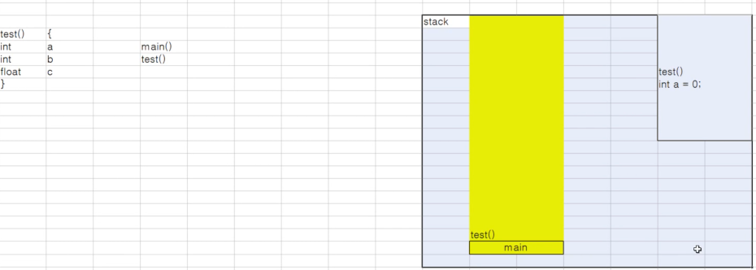
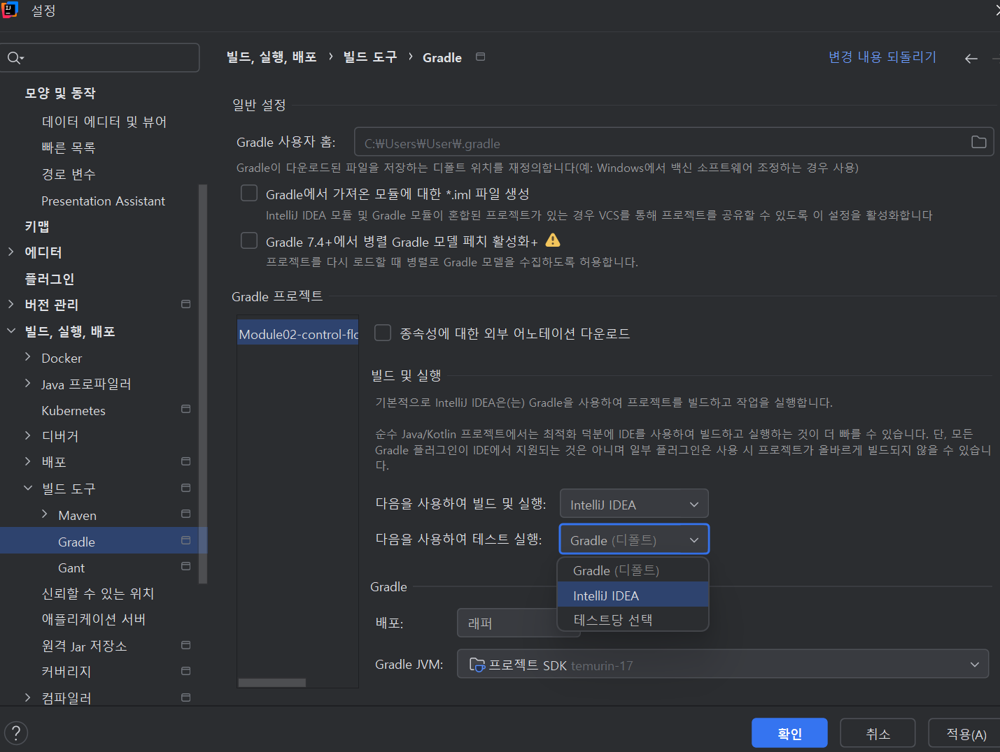

# [250313] 제어문, 반복문

## 목차
- [제어문](#제어문)
  - [if문 개념](#1-1-if문-개념)
  - [switch문 개념](#2-1-switch문-개념)
- [반복문](#반복문)
  - [for문 개념](#3-1-for문-개념)
  - [for-each문](#3-2-for-each문)
  - [while문](#3-5-while문)
- [메서드](#메서드-method)
  - [메서드 개념](#4-1-메서드-개념)
  - [메서드 종류](#4-3-메서드-종류)
- [TDD](#tdd)
- [etc.](#etc)
---

## **제어문**

### **1-1. if문 개념**

- 조건식의 결과(true/false)에 따라 실행 흐름을 분기하는 제어문.
- 형식: `if(조건식) { 실행 코드 } [ else { 대체 코드 } ]`
- 실생활 예시: *"비가 오면 우산을 챙기고, 아니면 그냥 간다."*

### **1-2. if문의 실행 흐름 및 메모리 구조**

- **JVM 스택 동작**
    - 조건식을 평가 후 결과(boolean)를 스택에 저장.
    - `true`면 코드 블록 실행, `false`면 다음 분기로 이동.
- **단락 평가 (Short-circuit Evaluation)**
    - `&&` (AND): 첫 번째 조건이 `false`면 두 번째 조건 평가 생략.
    - `||` (OR): 첫 번째 조건이 `true`면 두 번째 조건 평가 생략.
- **메모리 구조**
    - if문 내 변수는 스택에 저장됨.
    - 중첩 if문이 많으면 스택 사용 증가 → 가독성 저하.

### **1-3. 실행 흐름 예시**

- `main()`에서 `test()`를 호출하면,
    - `main`이 먼저 스택에 쌓임 → `test()`가 실행되면서 스택에 추가됨.
    - `test()` 종료 시, 지역 변수와 메서드는 메모리에서 해제되고 `main` 실행 재개.



### **2-1. switch문 개념**

- **switch문은 변수나 식의 값에 따라 실행 경로를 선택하는 제어문**이다.
- 다중 `if-else` 문을 대체할 수 있으며, **값 기반 분기**에 적합하다.

**✅ 기본 형식**

```java
switch (식) {
    case 값1:
        실행 코드;
        break;
    case 값2:
        실행 코드;
        break;
    default:
        기본 실행 코드;
}

```

✔ **식:** 비교 가능한 타입(정수, 문자열, `enum` 등)

✔ **case:** 특정 값과 비교하여 일치하면 실행

✔ **break:** 분기 종료, 없으면 **fall-through 발생**

✔ **default:** 모든 case와 일치하지 않을 때 실행

**🔹fall-through란?**

- `break`가 없으면 **다음 case로 실행이 연속됨**

```java
switch (2) {
    case 1:
        System.out.println("One");
    case 2:
        System.out.println("Two"); // 실행됨
    case 3:
        System.out.println("Three"); // 실행됨 (break 없음)
}
```

출력:

```
Two
Three
```

---

### **2-2. switch 깊은 개념 (JVM 관점)**

**✅ Jump Table을 이용한 최적화**

- JVM은 `switch` 문을 **Jump Table로 변환**하여 실행 속도를 향상시킬 수 있음.
- if-else는 조건을 순차적으로 비교하지만, **Jump Table은 특정 주소로 바로 이동**하여 **O(1)** 속도로 실행.

**🔹 Jump Table 예시**

```java

switch(2) {
    case 1: print(1); // 주소값이 저장되어 있어서 바로 그 주소값으로 이동
    case 2: print(2); // 인덱스 2번 참조 후 실행
}
```

➡ `case 2`의 실행 코드 주소를 **Jump Table에서 바로 찾음** → 빠른 실행

✔ **정수형 switch** → `Jump Table` 변환 가능 → O(1) 속도

✔ **문자열 switch** → `hashCode()` 기반 비교 → O(n) 속도

---

### **2-3. JDK 17에서 개선된 switch 문**

**✅ switch 표현식 (case -> 사용)**

- JDK 17부터 `case ->`를 사용하여 더 간결한 코드 작성 가능.
- `yield`를 사용하여 값을 반환할 수도 있음.

```java
int day = 3;
String result = switch (day) {
    case 1 -> "월요일";
    case 2 -> "화요일";
    case 3 -> {
        System.out.println("수요일");
        yield "수요일"; // 값을 반환
    }
    case 4 -> "목요일";
    case 5, 6, 7 -> "주말";
    default -> "기타";
};
```

✔ **break 없이 값 반환 가능 (`yield` 사용)**

✔ **가독성 개선 및 오류 방지**

---

## **반복문**

반복문은 **코드를 여러 번 실행할 수 있도록 하는 제어문**이다.

- **`for` 문** → 반복 횟수를 **알 때** 사용
- **`while` 문** → 반복 횟수를 **모를 때** 사용

---

### **3-1. for문 개념**

**✅ 기본 형식**

```java
for (초기식; 조건식; 증감식) {
    실행 코드;
}
```

✔ **초기식** → 반복 변수를 선언하고 초기화

✔ **조건식** → `true`면 실행, `false`면 종료

✔ **증감식** → 반복 변수 값을 변경

**🔹 for문 예제**

```java
for (int i = 0; i < 5; i++) {
    System.out.println("Hello " + i);
}
```

출력:

```
Hello 0
Hello 1
Hello 2
Hello 3
Hello 4
```

✔ **고정된 횟수의 반복 작업에 적합**

---

### **3-2. for-each문**

**✅ 기본 형식 (배열/컬렉션 순회)**

```java
for (타입 변수명 : 배열 또는 컬렉션) {
    실행 코드;
}
```

✔ **배열 또는 컬렉션의 요소를 자동으로 순회**

✔ **요소 개수를 미리 알 필요 없음**

**🔹 for-each문 예제**

```java
int[] numbers = {1, 2, 3, 4, 5};
for (int num : numbers) {
    System.out.println(num);
}
```

출력:

```
1
2
3
4
5
```

✔ **배열/컬렉션을 순회할 때 가독성이 좋고, 인덱스 관리가 필요 없음**

**🔹 for-each문 vs. for문**

| 비교 항목 | for문 | for-each문 |
| --- | --- | --- |
| **사용 대상** | ✅ 배열, 컬렉션, 일반적인 반복 작업 | ✅ 배열, 컬렉션 |
| **인덱스 접근 가능 여부** | ✅ 가능 (`arr[i]`) | ❌ 불가능 |
| **속도** | 🔹 배열에서는 빠름 (`arr[i]` 직접 접근) | 🔹 컬렉션에서는 최적화 가능 (Iterator) |
| **가독성** | 상대적으로 낮음 | 더 간결하고 가독성 높음 |
| **수정 가능 여부** | ✅ 가능 (`arr[i] = ...`) | ❌ 불가능 (`Iterator`를 사용해야 수정 가능) |

---

### **3-3. for문 동작 메모리 구조**

**✅ 실행 흐름**

1. **초기식 실행** → 반복 변수가 **스택(Stack)** 에 저장됨
2. **조건식 평가** → `true`면 실행, `false`면 반복 종료
3. **본문 실행** → 실행 코드 수행
4. **증감식 적용** → 변수 값 변경 후 다시 조건 검사

**🔹 Stack 메모리에서 for문 실행 과정 :** 

**for문 실행되며 i 변수가 어떻게 Stack 메모리에 저장되고 제거되는가?**

| 단계 | Stack 상태 | 설명 |
| --- | --- | --- |
| 초기화 | `[i=0]` | `i` 변수 생성 |
| 1회 반복 | `[i=0]` → `[i=1]` | `i=0` 출력 후 증가 |
| 2회 반복 | `[i=1]` → `[i=2]` | `i=1` 출력 후 증가 |
| 3회 반복 | `[i=2]` → `[i=3]` | `i=2` 출력 후 증가 |
| 종료 | `[] (비어있음)` | `i`가 제거됨 |

✔ **for문이 끝나면 스택에서 제거됨 → 메모리 효율적 관리**

- **for문이 실행될 때 `i` 변수는 Stack에 저장됨.**
- **반복이 진행되면서 값이 변경되지만, 같은 Stack 공간을 사용함.**
- **for문이 끝나면 `i` 변수가 Stack에서 제거됨.**

---

### **3-4. for문 성능 최적화**

**✅ 조건식 최적화**

```java
// 비효율적인 코드 (매 반복마다 arr.length 호출)
for (int i = 0; i < arr.length; i++) { ... }

// 최적화된 코드 (배열 길이를 미리 저장)
int len = arr.length;
for (int i = 0; i < len; i++) { ... }
```

✔ **배열의 길이(`arr.length`)를 반복문 전에 변수에 저장하면 불필요한 연산을 줄여 성능 향상**

---

### **3-5. while문**

- **조건식이 true인 동안 코드를 반복 실행**
- 반복 횟수가 **불확실**하거나 특정 조건에서 종료해야 할 때 유용

**✅ 기본 형식**

```java
while (조건식) {
    실행 코드;
}
```

**🔹 while문 예제**

```java
int count = 0;
while (count < 5) {
    System.out.println(count);
    count++;
}
```

출력:

```
0
1
2
3
4
```

✔ **조건을 만족하는 동안 실행되며, 특정 상황에서 종료 가능**

---

### **3-6. while문 제어 (break & continue)**

- **`break`** : 반복문 즉시 종료 후 빠져나감
- **`continue`** : 현재 반복을 건너뛰고 다음 반복으로 진행

**🔹 예제**

```java
int hp = 5;
while (hp > 0) {
    if (hp % 2 == 0) {
        System.out.println("독 늪지에 빠졌다. 체력 회복 후 진행");
        hp--;
        continue;
    }
    System.out.println("마왕과 전투! 남은 체력: " + hp);
    if (hp == 3) {
        System.out.println("축하합니다! 보물 상자 발견!");
        break;
    }
    hp--;
}
```

- **라벨(Label)** : 여러 개의 중첩 반복문에서 특정 반복문을 종료할 때 사용

**🔹 Label을 활용한 while문 예제**

```java
public class Application01 {
    public static void main(String[] args) {
        int count = 0;
        test:
        while (count < 5) {
            System.out.println(count);
            count++;
            while (true) {
                System.out.println(1);
                break test; // 바깥 while문 종료
            }
        }
    }
}
```

출력:

```
0
1
```

✔ **라벨을 활용하면 중첩된 루프에서 원하는 반복문을 종료할 수 있음**

---

### **3-7. while문 성능 최적화**

```java
// 1. 비최적화 while문 : 조건식에서 매번 계산
while (count <= counter()) { ... }

// 2. 최적화된 while문 : 메서드 호출 결과 캐싱
int result = counter();
while (count <= result) { ... }
```

✔ **조건식에서 불필요한 연산을 최소화하면 성능이 향상됨**

---

### **결론**

1. **for문** → 반복 횟수가 **고정된 경우** 적합
2. **for-each문** → 배열/컬렉션을 순회할 때 **가독성이 좋음**
3. **while문** → 반복 횟수가 **불확실한 경우** 적합
4. **break & continue**를 활용하여 흐름을 제어할 수 있음
5. **반복문 최적화를 통해 성능을 향상시킬 수 있음**

🚀 **적절한 반복문을 선택하여 코드 성능과 가독성을 개선하자!**

---

## 메서드 (Method)

### 4-1. 메서드 개념

- **메서드**는 **클래스**나 **객체의 속성**으로 정의된 함수이다.
- 자바에서는 클래스 내에서 정의된 모든 함수를 **메서드**라고 부른다.
- 메서드는 **객체의 동작**을 정의하며, **코드의 재사용성 및 가독성을 향상**시키는 역할을 한다.
- 자바의 메서드는 **인스턴스 메서드**(객체와 관련된 메서드)와 **정적 메서드**(클래스와 관련된 메서드)로 구분된다.

### 4-2. 메서드 기본 형식

```
[접근제어자] [반환타입] 메서드명([매개변수]) {
    실행할 코드;
    return 반환값;
}
```

### 4-2-1. 접근제어자

- `public` : 모든 클래스에서 접근 가능
- `protected` : 같은 패키지 또는 자식 클래스에서 접근 가능
- `private` : 같은 클래스 내에서만 접근 가능
- `default` : 같은 패키지 내에서만 접근 가능

### 4-2-2. 반환 타입

- `void` : 반환 값이 없는 경우 사용
- `int, char, double 등` : 기본 자료형 반환
- `String, 객체 등` : 참조 자료형 반환

### 4-2-3. 매개변수

- 메서드 호출 시 전달되는 입력값을 정의
- 여러 개의 매개변수를 가질 수 있으며, 일반 변수처럼 타입과 이름을 갖는다.

**메서드 예제**

```java
public class Application01 {
    public static void main(String[] args) {
        Application01 app = new Application01();
        int result = app.add(10, 20);
        System.out.println(result);
    }

    /**
     * 두 정수를 더하는 메서드
     * @param a : 첫 번째 정수
     * @param b : 두 번째 정수
     * @return 두 정수의 합
     */
    public int add(int a, int b){
        return a + b;
    }
}
```

---

### 4-3. 메서드 종류

### 4-3-1. 정적 메서드 (Static Method)

- 클래스에 속하며, **객체 생성 없이 호출 가능**하다.
- JVM의 **메서드 영역**에 저장되며 모든 객체가 공유한다.
- **인스턴스 변수나 인스턴스 메서드를 직접 사용할 수 없다.**
- 호출 방식: `클래스명.메서드명()`

```java
public class Application02Method {
    public static void getGreeting() {
        System.out.println("Hello World");
    }
}

public class Main {
    public static void main(String[] args) {
        Application02Method.getGreeting();
    }
}
```

### 4-3-2. 인스턴스 메서드 (Instance Method)

- **객체를 생성한 후**에 호출할 수 있는 메서드이다.
- JVM의 **힙(Heap) 영역**에 저장되며, 객체와 함께 동작한다.
- 개별 객체마다 독립적으로 존재한다.
- 호출 방식: `객체명.메서드명()`

```java
public class Application02Method {
    public String instanceMethod() {
        return "인스턴스 메서드 입니다.";
    }
}

public class Main {
    public static void main(String[] args) {
        Application02Method obj = new Application02Method();
        System.out.println(obj.instanceMethod());
    }
}
```

### 4-3-3. 생성자 (Constructor)

- **클래스의 인스턴스를 생성할 때 호출되는 특별한 메서드**이다.
- 반환 타입이 없으며, 클래스의 이름과 동일하다.

```java
public class Person {
    String name;

    // 생성자
    public Person(String name) {
        this.name = name;
    }
}

public class Main {
    public static void main(String[] args) {
        Person p = new Person("홍길동");
        System.out.println(p.name);
    }
}
```

### 4-3-4. 메서드 오버로딩 (Method Overloading)

- 같은 이름의 메서드를 매개변수의 **개수, 타입, 순서**를 다르게 하여 여러 개 정의하는 것
- **컴파일러가 메서드 호출 시 전달된 인자의 타입을 보고 적절한 메서드를 선택**

```java
public class Application02Method {
    public String overloadedMethod() {
        return "Hello overload";
    }

    public String overloadedMethod(String name) {
        return "Hello " + name;
    }
}

public class Main {
    public static void main(String[] args) {
        Application02Method obj = new Application02Method();
        System.out.println(obj.overloadedMethod());
        System.out.println(obj.overloadedMethod("Java"));
    }
}
```

---

### 4-5. 메서드와 성능 최적화

### 4-5-1. 메서드 호출과 오버헤드

- 메서드 호출 시 **스택 프레임(Stack Frame)** 생성 및 제거로 **약간의 오버헤드**가 발생
- JIT(Just-In-Time Compiler)는 자주 호출되는 메서드를 **인라인(Inlining) 최적화**
- 너무 작은 메서드는 호출 오버헤드 증가 가능성 있음

### 4-5-2. 단일 책임 원칙(SRP)

- 메서드는 **하나의 책임(기능)만 가져야 하며, 변경 이유가 하나여야 함**
- 장점:
    - 가독성 향상
    - 유지보수성 증가
    - 성능 최적화 용이 (JIT 인라인 최적화 가능성 높아짐)

### 4-5-3. 성능 최적화 기법

1. **메서드 크기 조정**: 작고 응집력 있는 메서드로 설계
2. **객체 생성 최소화**: 반복문 내에서 불필요한 객체 생성 피하기
3. **메서드 호출 최소화**: 상수 계산을 반복문 밖으로 이동
4. **예외 처리 최적화**: 예외를 제어 흐름으로 사용하지 않기

```java
public class MethodOptimization {
    public static void main(String[] args) {
        long startTime = System.currentTimeMillis();
        String result = "";
        for (int i = 1; i <= 1000; i++) {
            result += addText(result, "안녕 " + i);
        }
        long endTime = System.currentTimeMillis();
        System.out.println("실행 시간: " + (endTime - startTime) + "ms");
    }

    public static String addText(String base, String text) {
        return base + text;
    }
}
```

---

## 결론

- 메서드는 **코드의 재사용성, 유지보수성, 성능 최적화**에 중요한 역할을 한다.
- **정적 메서드와 인스턴스 메서드를 구분**하여 적절히 사용해야 한다.
- **단일 책임 원칙(SRP)**을 준수하여 가독성과 성능을 모두 고려하는 것이 중요하다.

---

## TDD

- 요구사항의 결과 값에 맞춰 테스트부터 생성
- 테스트에 들어가 있는 필요한 해당 메서드를 클래스에 작성
- 메서드엔 주석으로 param과 return과 함수 설명

설정



```java
public class Application {
    public static void main(String[] args) {

    }

    /**
     * 쉼표로 구분된 숫자 문자열을 받아 합계, 짝수 개수, 홀수 개수를 계산하여
     * 결과를 문자열로 반환하는 함수.
     *
     * @param input 쉼표로 구분된 숫자 문자열(예: 10, 20, 30, 40)
     * @return "합계:<sum>, 평균: <avg>, 짝수 개수 : <evenCount>, 홀수 개수: <addCount> 형태의 결과
     */
    public String processNumbers(String input) {
        if (input == null || input.isEmpty()) {
        return "입력 없음";
        }
        // 입력 문자열에서 모든 공백을 제거
        String cleanedInput = input.replace(" ", "");

        // 쉼표(,) 기준으로 문자열 배열을 생성
        String[] parts = cleanedInput.split(",");

        int sum = 0;
        int evenCount = 0;
        int oddCount = 0;
        int count = parts.length;

        // for문 사용하여 각 배열 요소를 순차적으로 정수로 변환
        for (String part : parts) {
            int number = Integer.parseInt(part);

            // 합계 구하기
            sum += number;

            if (number % 2 == 0) {
                // 짝수 개수 구하기
                evenCount++;
            } else {
                // 홀수 개수 구하기
                oddCount++;
            }
        }
        // 평균 구하기
        int avg = sum / count;

        return String.format("합계: %d, 평균: %d, 짝수 개수: %d, 홀수 개수: %d", sum, avg, evenCount, oddCount);
    }

}
```

---

## etc.

### Java에서의 변수 명명법

- 변수는 명사로 짓는다
- 함수는 동사로 짓는다
- Java에서는 카멜 케이스만 쓴다. 상수 변수만 대문자와 스네이크 케이스 사용

### 1. 자바스크립트 vs 자바: 실행 방식 차이

🔹 **자바스크립트는 비동기 프로그래밍을 사용한다.**

- **단일 쓰레드(Single Thread)**: 자바스크립트는 기본적으로 하나의 **쓰레드(Thread, 실행 흐름 단위)**만 사용한다.
- **이벤트 루프(Event Loop)**: 자바스크립트는 실행해야 할 작업을 **대기열(Queue)**에 넣어두고, 현재 실행 중인 코드가 끝나면 다음 작업을 처리한다.
- **비동기(Asynchronous)**: 특정 작업이 완료될 때까지 기다리지 않고, 다음 작업을 먼저 진행할 수 있다.
- 예: `setTimeout()`, `fetch()` 같은 비동기 함수는 실행되면 **대기열(Queue)에 들어가고**, 나중에 결과가 준비되면 실행된다.
    
    ```jsx
    console.log("작업 시작");
    
    setTimeout(() => {
        console.log("3초 후 실행됨");
    }, 3000);
    
    console.log("다음 작업 실행")
    ```
    
    **출력 결과**:
    
    ```
    작업 시작
    다음 작업 실행
    3초 후 실행됨
    ```
    
    - `setTimeout()`이 3초 동안 대기하는 동안, 다음 줄의 코드(`console.log("다음 작업 실행")`)가 먼저 실행됨.
    - 자바스크립트는 이런 방식으로 **이벤트 루프를 활용하여 여러 작업을 동시에 처리하는 것처럼 동작**한다.

---

🔹 **자바는 기본적으로 동기 프로그래밍을 사용한다.**

- **멀티 쓰레드(Multi Thread)**: 자바는 여러 개의 **쓰레드**를 동시에 실행할 수 있다.
- **동기(Synchronous) 실행**: 기본적으로 한 작업이 끝나야 다음 작업이 실행된다.
- **멀티쓰레딩 지원**: 동시에 여러 작업을 처리하려면 `Thread` 클래스를 활용하여 직접 멀티쓰레딩을 구현해야 한다.
    
    ```java
    public class SyncExample {
        public static void main(String[] args) {
            System.out.println("작업 시작");
    
            try {
                Thread.sleep(3000);  // 3초 동안 대기
            } catch (InterruptedException e) {
                e.printStackTrace();
            }
    
            System.out.println("3초 후 실행됨");
        }
    }
    ```
    
    **출력 결과**:
    
    ```
    작업 시작
    (3초 대기)
    3초 후 실행됨
    ```
    
    - `Thread.sleep(3000)` 때문에 3초 동안 멈춘 후, 그다음 코드가 실행된다.
    - 자바는 기본적으로 동기적으로 실행되며, 병렬 실행을 위해서는 **멀티쓰레딩 기법**을 사용해야 한다.
    - **멀티쓰레딩을 사용하면 여러 개의 작업을 동시에 실행할 수 있지만, 동시성(Concurrency)과 트랜잭션 격리 수준(Isolation Level) 등을 고려해야 하기 때문에 관리할 것이 많다.**

---

## 참고자료